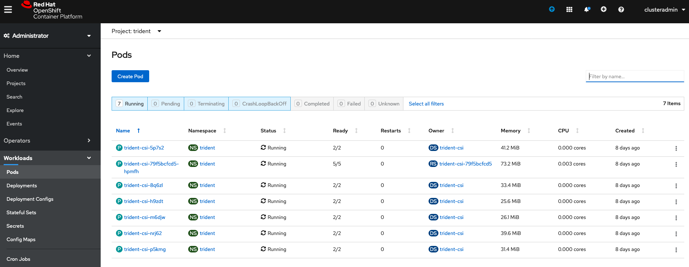
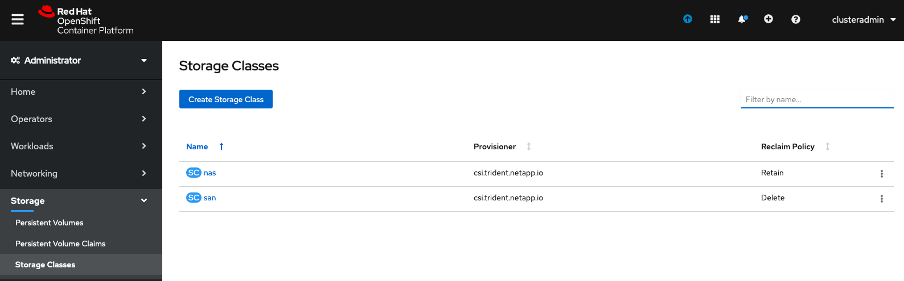

# Webinar Trident
Webinar Trident: El orquestador de almacenamiento para contenedores

## Configuración inicial

### Instalación de Trident

El proceso de [instalación de Trident](https://netapp-trident.readthedocs.io/en/stable-v20.04/kubernetes/tridentctl-install.html#install-trident) puede consultarse en la web oficial. Los pasos realizados para la demo han sido lo siguiente.

Creación de nu nuevo namespace llamado 'trident'.

```shell
oc create namespace trident
```

Descargar la última versión de Trident y descomprimirlo.

```shell
wget https://github.com/NetApp/trident/releases/download/v20.04.0/trident-installer-20.04.0.tar.gz

tar -xf trident-installer-20.04.0.tar.gz

cd trident-installer
```

Instalar trident con el cliente 'tridentctl' sobre el namespace 'trident'

```shell
./tridentctl install -n trident
```

Se puede observar desde OpenShift los PODs que se ejecutan dentro de Deployment y DaemonSet.



### Creación de backends de almacenamiento

Se han definido dos backends de almacenamiento, uno con el driver ontap-san, y otro con el driver ontap-nas.

```shell
tridentctl create backend --filename backend-nas.json -n trident
tridentctl create backend --filename backend-san.json -n trident
```

### Creación de clases de almacenamiento

Se han definido dos clases de almacenamiento, usando el aprovisionador CSI Trident y referenciando a los backends de almacenamiento previamente creados.

```shell
oc apply -f sc-san.yaml
oc apply -f sc-nas.yaml
```

Verificar las Storage Classes desde OpenShift



### Preparación

#### [Modos de acceso](../2_access_mode/access_mode.md)

```shell
oc create namespace 1-webinar
oc apply -f ../templates/hello-world-persistent-data-example.yaml -n 1-webinar
```

#### [Controladores de Kubernetes](../3_k8s_controllers/k8s_controllers.md)

```shell
oc create namespace 2-webinar
oc apply -f ../templates/todo-app-3tier-architecture.yaml -n 2-webinar
```

#### [Volume import](../4_volume_import/volume_import.md)

```shell
oc create namespace 3-webinar
oc apply -f ../templates/legacy-web.yaml -n 3-webinar
```

Se prepara la página web legacy desde el jumhopst 10.67.217.190

```shell
mkdir -p /mnt/website
mount -t nfs 10.67.217.6:website /mnt/website
git clone https://github.com/pablogarciaarevalo/demo-trident/
cp -R demo-trident/making/netapp_website/v1/* /mnt/website/
docker run --name docker-nginx -p 80:80 -d -v /mnt/website:/usr/share/nginx/html nginx
```

#### [CSI snapshots](../5_CSI_Snapshot/csi_snapshot.md)

```shell
oc create namespace 4-webinar
oc apply -f ../templates/jupyter-covid.yaml -n 4-webinar
chmod +x ../5_CSI_Snapshot/get-jupyter-tokens.sh
```

Se prepara el datalake desde el jumhopst 10.67.217.190
```shell
mkdir -p /mnt/datalake
mount -t nfs 10.67.217.6:datalake /mnt/datalake
git clone https://github.com/CSSEGISandData/COVID-19.git
cp COVID-19/csse_covid_19_data/csse_covid_19_daily_reports/*.csv /mnt/datalake/
```

Se crea la clase de snapshots:

```shell
oc apply -f volumesnapshotclass.yaml
```

#### [K8s en Cloud](../6_K8s_on_cloud/k8s_on_cloud.md)

Instalar k3s y configurar Trident

```shell
curl -sfL https://get.k3s.io | sh -

kubectl create ns trident
./tridentctl install -n trident

tridentctl create backend --filename backend-cloud.json -n trident

kubectl apply -f apply -f sc-nas.yaml
```

Hacer dos clones del volumen website replicado e importarlos en Kubernetes

```shell
tridentctl import volume BackendForNAS website_clone_1 -f pvc-clone-1.yaml -n trident

tridentctl import volume BackendForNAS website_clone_2 -f pvc-clone-2.yaml -n trident
```

Se montan los clones y se modifica el contenido del clone2.
```shell
mkdir -p /mnt/web-clone-1
mount -t nfs 172.30.2.154:/trident_pvc_a0f5fd01_0008_488f_8f97_455c40d4081e /mnt/web-clone-1

mkdir -p /mnt/web-clone-2
mount -t nfs 172.30.2.154:/trident_pvc_ce929c42_17a0_46d2_afe3_9dd0763c925b /mnt/web-clone-2
cp -R /root/demo-trident/making/netapp_website/v2/* /mnt/web-clone-2/
```

Se crean los servicios usando los PV clonados
```shell
kubectl apply -f service_cloned_1.yaml
kubectl apply -f service_cloned_2.yaml
kubectl get all -n web
```

Se instala el dashboard de Kubernetes y se proporciona acceso:

```shell
kubectl create -f https://raw.githubusercontent.com/kubernetes/dashboard/v1.10.1/src/deploy/alternative/kubernetes-dashboard.yaml
kubectl create clusterrolebinding kubernetes-dashboard   --clusterrole=cluster-admin   --serviceaccount=kube-system:kubernetes-dashboard
kubectl proxy --address 0.0.0.0 --accept-hosts '.*' &
```


Tras todo esto, se explican los diferentes [modos de acceso](../2_access_mode/access_mode.md) al almacenamiento.
