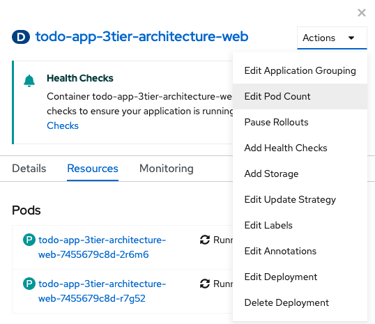
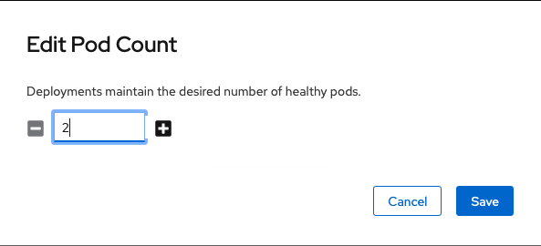
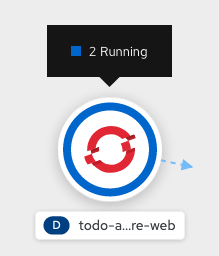

# Webinar Trident
Webinar Trident: El orquestador de almacenamiento para contenedores

## Controladores de Kubernetes

>  SLIDE 4

Existen varios tipos de controladores de Kubernetes:
- ReplicaSet
- Deployment
- StatefulSet
- DaemonSet

Los Deployment, inicialmente creados para aplicaciones stateless, se utilizan cuando el modo de acceso al Persistent Volume es Read-Write-Many. Los StatefulSet, creados para aplicaciones stateful, se utilizan cuando el modo de acceso al Persistent Volume es Read-Write-Once.

### Ejecución de aplicaciones To-Do basada en una arquitectura de 3 capas

>  SLIDE 5

En este ejemplo se despliega una sencilla aplicación basada en una arquitectura de 3 capas: frontal web para la capa de presentación, un servicio API para la capa de aplicación y un backend para la capa de datos.

Desde la parte de Developer de OpenShift Container Platform, se accede a Topology a se selecciona 'From Catalog'.

Se busca la aplicación To-Do

Se instancia la plantilla.

Se cambian los variables que se desean:

### Verificación de la aplicación

Tras unos minutos se comprueba el estado de la aplicación.

Se verifica los Persistent Volume Claims creados.

Se verifica los Persistent Volumes creados.

### Escalado horizontal de la aplicación

Un ejemplo de escalado del frontal web para la capa de presentación creado como un Deployment.

Un ejemplo de escalado del frontal web para la capa de presentación creado como un Statefulset.

Se edita el fichero YAML pasando las réplicas de 1 a 2.

Se verifican el número de PODs en el deployment y el statefulset.

Se verifica los Persistent Volume Claims creados.

Se verifica los Persistent Volumes creados.

El siguiente ejemplo muestra la funcionalidad [volume import](../4_volume_import/volume_import.md) de Trident.

