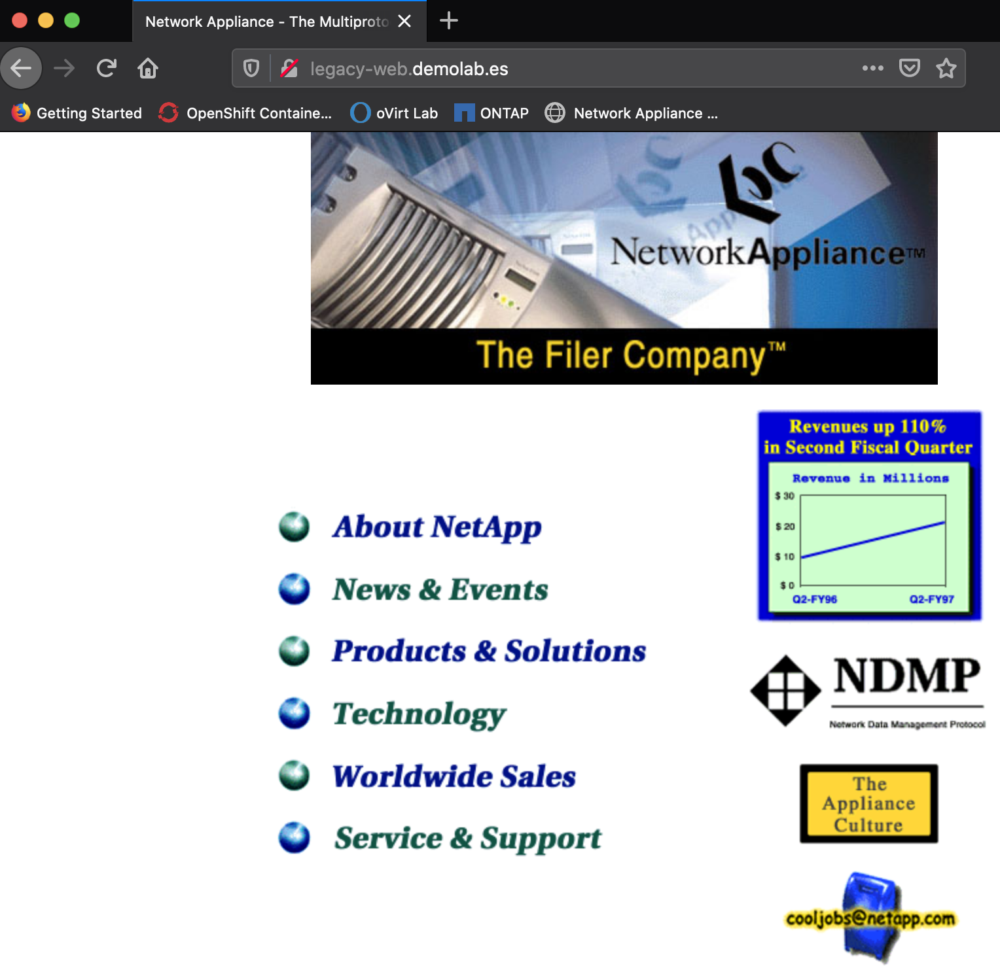
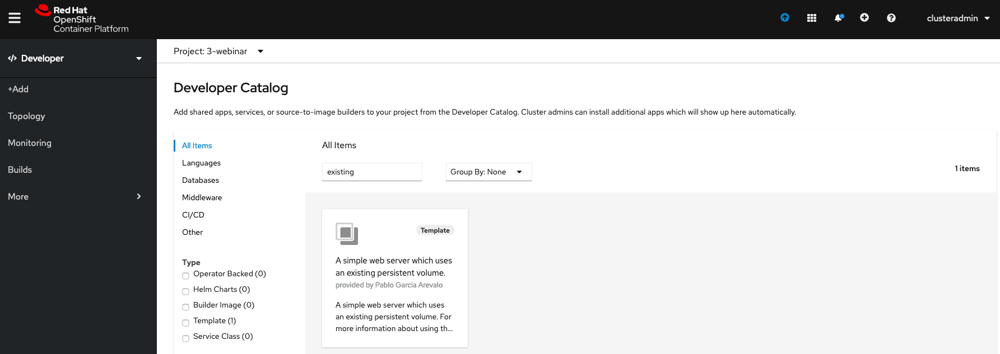

# Webinar Trident
Webinar Trident: El orquestador de almacenamiento para contenedores

>  SLIDE 6

## Volume Import

>  SLIDE 7

Se muestra una página web legacy [http://legacy-web.demolab.es](http://legacy-web.demolab.es) ejecutándose en un servidor convencional teniendo el contenido en un volumen NFS exportado desde un sistema ONTAP.



```shell
tridentctl import volume BackendForNAS website -f 4_volume_import/pvc-website.yaml -n trident
```

Se observa que se ha importado el volumen como un Persistent Volume Claim y Persistent Volume manteniendo sus datos y su acceso anterior.


Desde la parte de Developer de OpenShift Container Platform, se accede a Topology a se selecciona 'From Catalog'.


Se busca la aplicación



Se instancia la plantilla.


Se cambian los variables que se desean:


### Verificación de la aplicación

Tras unos minutos se comprueba el estado de la aplicación.


Accediendo al enlace de la aplicación [http://legacy-web-3-webinar.apps.ocp1.demolab.es/](http://legacy-web-3-webinar.apps.ocp1.demolab.es/) se comprueba que se ha importado el servicio web legacy dentro de OpenShift usando una estrategia Lift & Shift.


El siguiente ejemplo muestra la funcionalidad los [CSI snapshots](../5_CSI_Snapshot/csi_snapshot.md) usando Trident.