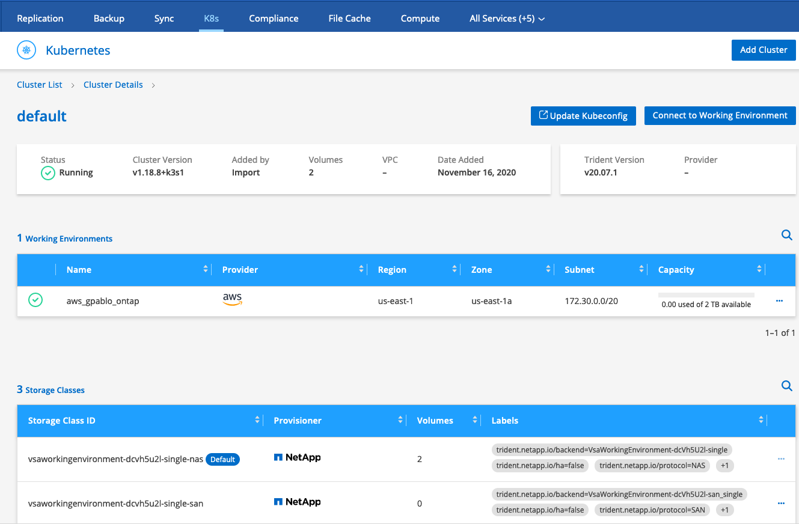
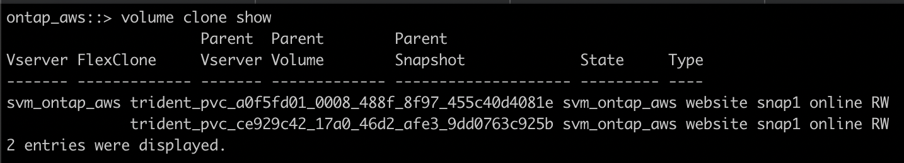

# Webinar Trident
Webinar Trident: El orquestador de almacenamiento para contenedores

## Kubernetes en Cloud

>  SLIDE 11

Se dispone de una VPC en AWS, con un sistema Cloud Volumes ONTAP, Cloud Manager y una instancia EC2 con Kubernetes.

Desde Cloud Manager se gestiona el sistema ONTAP on-prem y el sistema ONTAP en AWS.

Se tiene replicado hacia el sistema ONTAP sobre AWS el volumen website visto en un paso anterior que reside on-prem.

Se disponen de otros dos volumenes, que se han importado sobre Kubernetes con trident con el mismo procedimiento visto anteriormente.

Estos dos volúmenes son clones del volumen replicado, por lo que son copias en lectura/escritura eficientes en cuanto al espacio consumido.

Se dispone de un cluster de Kubernetes ligero (k3s) sobre una instancia EC2 de AWS en la misma VPC.

Y se han creado dos deployment, cada uno con un POD con el mismo servicio web visto en ejemplos anteriores.

Accediendo a uno de los servicios (en modo NodePort) de Kubernetes, vemos el mismo servicio web que se tenía on-prem, que podría representar una estrategia de Cloud Bursting.

[http://172.30.2.59:30007/](http://172.30.2.59:30007/)

Accediendo al otro servicio (en modo NodePort) de Kubernetes, vemos una web modificada y moderna, que podría representar una estrategia del uso de Cloud para entornos de desarrollo.

[http://172.30.2.59:30008/](http://172.30.2.59:30008/)

>  SLIDE 12
